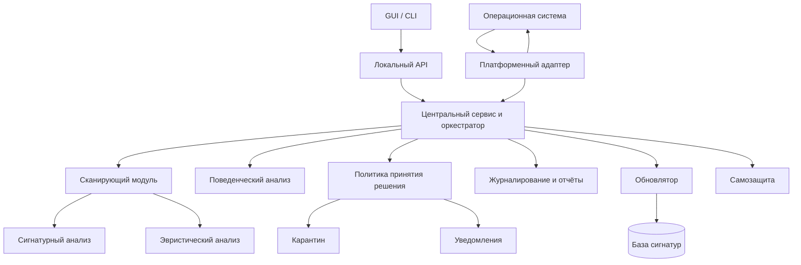
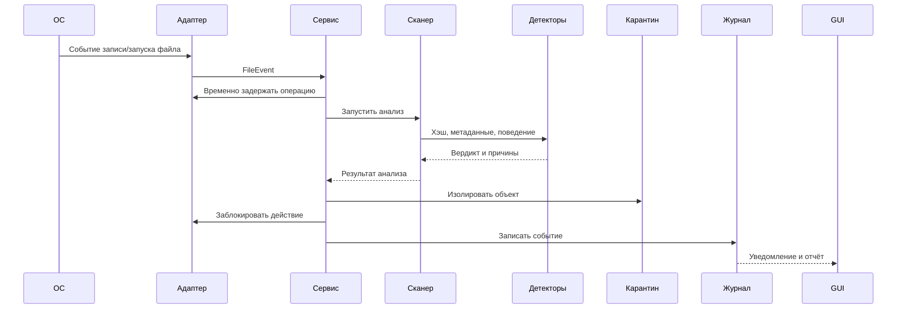
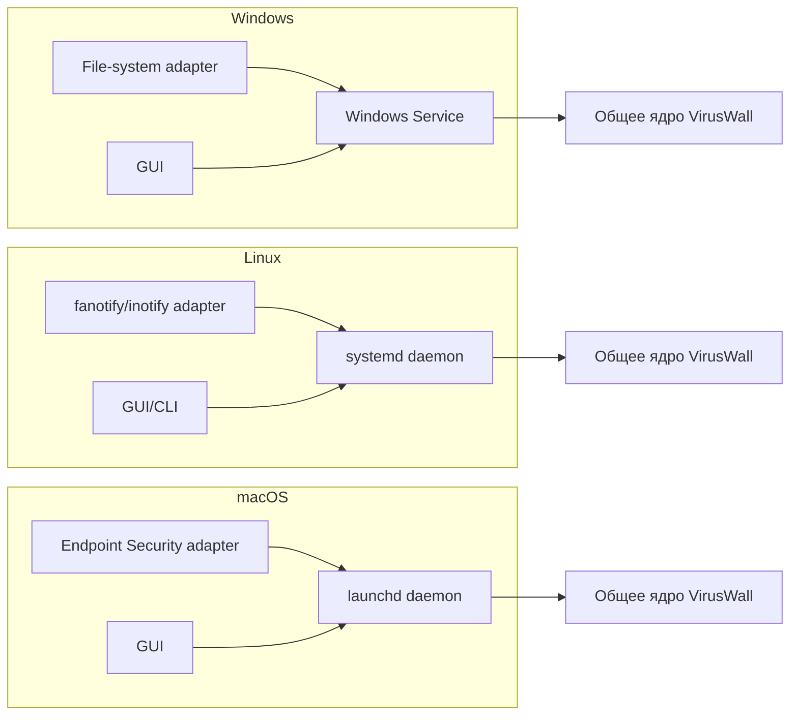

# Диаграммы архитектуры VirusWall

## Компонентная архитектура

```mermaid
flowchart TB
    UI[GUI / CLI] --> API[Локальный API]
    API --> CORE[Центральный сервис и оркестратор]
    CORE --> SCAN[Сканирующий модуль]
    SCAN --> SIG[Сигнатурный анализ]
    SCAN --> HEU[Эвристический анализ]
    CORE --> BEH[Поведенческий анализ]
    CORE --> POL[Политика принятия решения]
    POL --> Q[Карантин]
    POL --> NOTIFY[Уведомления]
    CORE --> LOG[Журналирование и отчёты]
    CORE --> UPD[Обновлятор]
    UPD --> DB[(База сигнатур)]
    CORE --> SELF[Самозащита]
    OS[Операционная система] --> ADAPT[Платформенный адаптер]
    ADAPT --> CORE
    ADAPT --> OS
```

## Последовательность обнаружения

```mermaid
sequenceDiagram
    participant OS as ОС
    participant A as Адаптер
    participant S as Сервис
    participant C as Сканер
    participant D as Детекторы
    participant Q as Карантин
    participant L as Журнал
    participant UI as GUI
    OS->>A: Событие записи/запуска файла
    A->>S: FileEvent
    S->>A: Временно задержать операцию
    S->>C: Запустить анализ
    C->>D: Хэш, метаданные, поведение
    D-->>C: Вердикт и причины
    C-->>S: Результат анализа
    S->>Q: Изолировать объект
    S->>A: Заблокировать действие
    S->>L: Записать событие
    L-->>UI: Уведомление и отчёт
```

## Развёртывание

```mermaid
flowchart LR
    subgraph Windows
      WS[Windows Service]
      WF[File-system adapter]
      WG[GUI]
    end
    subgraph Linux
      LS[systemd daemon]
      LF[fanotify/inotify adapter]
      LG[GUI/CLI]
    end
    subgraph macOS
      MS[launchd daemon]
      MF[Endpoint Security adapter]
      MG[GUI]
    end
    WS --> WCORE[Общее ядро VirusWall]
    LS --> LCORE[Общее ядро VirusWall]
    MS --> MCORE[Общее ядро VirusWall]
    WF --> WS
    LF --> LS
    MF --> MS
    WG --> WS
    LG --> LS
    MG --> MS
```
